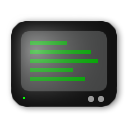

# stdout-ext

> Simple Chrome extension for showing console logs from *other* Chrome extensions

## Why?

Seeing console log output can be crucial for debugging Chrome extensions, especially when they use a manifest V3 service worker in the background to respond to user-generated events, like a tab opening, the focus changing, etc.  Sure, you can inspect the service worker console, but leaving that devtools window open keeps the service worker active.  So you'll never see your extension go through the transition from active to inactive and back again &mdash; which is often where bugs sneak in.

`stdout-ext` provides an easy way to send console output from your service worker or other extension pages *without* keeping your background scripts active.

## Installation
